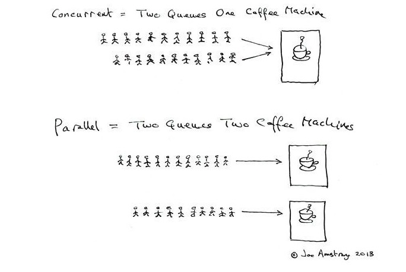

[TOC]

# 1.知识点

### 并行和并发有什么区别？

发（concurrency）和并行（parallellism）是：

解释一：并行是指两个或者多个事件在同一时刻发生；而并发是指两个或多个事件在同一时间间隔发生。

解释二：并行是在不同实体上的多个事件，并发是在同一实体上的多个事件。

解释三：在一台处理器上“同时”处理多个任务，在多台处理器上同时处理多个任务。如hadoop分布式集群

所以并发编程的目标是充分的利用处理器的每一个核，以达到最高的处理性能。

如下图：

并发 = 两个队列和一台咖啡机。

并行 = 两个队列和两台咖啡机。

### 线程和进程的区别？

**性质不同**

进程（Process）是计算机中的程序关于某数据集合上的一次运行活动，是系统进行资源分配和调度的基本单位，是操作系统结构的基础。

线程（英语：thread）是操作系统能够进行运算调度的最小单位。它被包含在进程之中，是进程中的实际运作单位。

**适用范围不同**

使用进程目的在于清晰地刻画动态系统的内在规律，有效管理和调度进入计算机系统主存储器运行的程序。

线程为操作系统内核调度的内核线程，如Win32线程；由用户进程自行调度的用户线程，如Linux平台的POSIX Thread；或者由内核与用户进程，如Windows 7的线程，进行混合调度。

### 守护线程是什么？

守护线程是运行在后台的一种特殊进程。它独立于控制终端并且周期性地执行某种任务或等待处理某些发生的事件。在 Java 中垃圾回收线程就是特殊的守护线程。

### 什么是线程安全？

当多个线程访问同一个对象时，如果不用考虑这些线程在运行时环境下的调度和交替运行，也不需要进行额外的同步，或者在调用方进行任何其他的协调操作，调用这个对象的行为都可以获取正确的结果，那这个对象是线程安全的。

### 什么是线程调度器(Thread Scheduler)和时间分片(Time Slicing)？

线程调度器是一个操作系统服务，它负责为Runnable状态的线程分配CPU时间。一旦创建一个线程并启动它，它的执行便依赖于线程调度器的实现。

时间分片是指将可用的CPU时间分配给可用的Runnable线程的过程。分配CPU时间可以基于线程优先级或者线程等待的时间。

线程调度并不受到Java虚拟机控制，所以由应用程序来控制它是更好的选择。

### 1.1 **volatile关键字， Lock**

并发编程中：原子性问题，可见性问题，有序性问题。

volatile关键字能保证可见性，字能禁止指令重排序，但是不能保证原子性。可见性只能保证每次读取的是最新的值，但是volatile没办法保证对变量的操作的原子性。在生成的会变语句中加入Lock关键字和内存屏障。

Lock 实现提供了比使用synchronized 方法和语句可获得的更广泛的锁定操作，它能以更优雅的方式处理线程同步问题。用sychronized修饰的方法或者语句块在代码执行完之后锁自动释放，而用Lock需要我们手动释放锁

### 1.2 创建线程有几种不同的方式？你喜欢哪一种？为什么？

1. 继承Thread类
2. 实现Runnable接口
3. 应用程序可以使用Executor框架来创建线程池
4. 实现Callable接口。

我更喜欢实现Runnable接口这种方法，当然这也是现在大多程序员会选用的方法。因为一个类只能继承一个父类而可以实现多个接口。同时，线程池也是非常高效的，很容易实现和使用。

### 1.3 Thread类的sleep()方法和对象的wait()方法都可以让线程暂停执行，它们有什么区别?

答：sleep()方法（休眠）是线程类（Thread）的静态方法，调用此方法会让当前线程暂停执行指定的时间，将执行机会（CPU）让给其他线程，但是对象的锁依然保持，因此休眠时间结束后会自动恢复。wait()是Object类的方法，调用对象的wait()方法导致当前线程放弃对象的锁（线程暂停执行），进入对象的等待池（wait pool），只有调用对象的notify()方法（或notifyAll()方法）时才能唤醒等待池中的线程进入等锁池（lock pool），如果线程重新获得对象的锁就可以进入就绪状态。

### 1.4.**线程的sleep()方法和yield()方法有什么区别？**

答：

1. sleep()方法给其他线程运行机会时不考虑线程的优先级，因此会给低优先级的线程以运行的机会；yield()方法只会给相同优先级或更高优先级的线程以运行的机会；
2.  线程执行sleep()方法后转入阻塞（blocked）状态，而执行yield()方法后转入就绪（ready）状态；
3. sleep()方法声明抛出InterruptedException，而yield()方法没有声明任何异常；
4. sleep()方法比yield()方法（跟操作系统CPU调度相关）具有更好的可移植性。

### 1.5.**synchronized关键字的用法？**

答：synchronized关键字可以将对象或者方法标记为同步，以实现对对象和方法的互斥访问，可以用synchronized(对象) { … }定义同步代码块，或者在声明方法时将synchronized作为方法的修饰符。

### 1. 6.***\*简述synchronized 和java.util.concurrent.locks.Lock的异同？\****

答：Lock是Java 5以后引入的新的API，和关键字synchronized相比主要相同点：Lock 能完成synchronized所实现的所有功能；主要不同点：Lock有比synchronized更精确的线程语义和更好的性能，而且不强制性的要求一定要获得锁。synchronized会自动释放锁，而Lock一定要求程序员手工释放，并且最好在finally 块中释放（这是释放外部资源的最好的地方）

### 1.7 怎么防止死锁？

1. 尽量使用 tryLock(long timeout, TimeUnit unit)的方法(ReentrantLock、ReentrantReadWriteLock)，设置超时时间，超时可以退出防止死锁。
2. 尽量使用 Java. util. concurrent 并发类代替自己手写锁。
3. 尽量降低锁的使用粒度，尽量不要几个功能用同一把锁。
4. 尽量减少同步的代码块。

### 多线程中 synchronized 锁升级的原理是什么？

synchronized 锁升级原理：在锁对象的对象头里面有一个 threadid 字段，在第一次访问的时候 threadid 为空，jvm 让其持有偏向锁，并将 threadid 设置为其线程 id，再次进入的时候会先判断 threadid 是否与其线程 id 一致，如果一致则可以直接使用此对象，如果不一致，则升级偏向锁为轻量级锁，通过自旋循环一定次数来获取锁，执行一定次数之后，如果还没有正常获取到要使用的对象，此时就会把锁从轻量级升级为重量级锁，此过程就构成了 synchronized 锁的升级。

锁的升级的目的：锁升级是为了减低了锁带来的性能消耗。在 Java 6 之后优化 synchronized 的实现方式，使用了偏向锁升级为轻量级锁再升级到重量级锁的方式，从而减低了锁带来的性能消耗。

### ThreadLocal 是什么？有哪些使用场景？

ThreadLocal 为每个使用该变量的线程提供独立的变量副本，所以每一个线程都可以独立地改变自己的副本，而不会影响其它线程所对应的副本。

ThreadLocal 的经典使用场景是数据库连接和 session 管理等。

### 说一下 synchronized 底层实现原理？

synchronized 是由一对 monitorenter/monitorexit 指令实现的，monitor 对象是同步的基本实现单元。在 Java 6 之前，monitor 的实现完全是依靠操作系统内部的互斥锁，因为需要进行用户态到内核态的切换，所以同步操作是一个无差别的重量级操作，性能也很低。但在 Java 6 的时候，Java 虚拟机 对此进行了大刀阔斧地改进，提供了三种不同的 monitor 实现，也就是常说的三种不同的锁：偏向锁（Biased Locking）、轻量级锁和重量级锁，大大改进了其性能。

### synchronized 和 volatile 的区别是什么？

- volatile 是变量修饰符；synchronized 是修饰类、方法、代码段。
- volatile 仅能实现变量的修改可见性，不能保证原子性；而 synchronized 则可以保证变量的修改可见性和原子性。
- volatile 不会造成线程的阻塞；synchronized 可能会造成线程的阻塞。

### synchronized 和 Lock 有什么区别？

- synchronized 可以给类、方法、代码块加锁；而 lock 只能给代码块加锁。
- synchronized 不需要手动获取锁和释放锁，使用简单，发生异常会自动释放锁，不会造成死锁；而 lock 需要自己加锁和释放锁，如果使用不当没有 unLock()去释放锁就会造成死锁。
- 通过 Lock 可以知道有没有成功获取锁，而 synchronized 却无法办到。

### synchronized 和 ReentrantLock 区别是什么？

synchronized 早期的实现比较低效，对比 ReentrantLock，大多数场景性能都相差较大，但是在 Java 6 中对 synchronized 进行了非常多的改进。

主要区别如下：

- ReentrantLock 使用起来比较灵活，但是必须有释放锁的配合动作；
- ReentrantLock 必须手动获取与释放锁，而 synchronized 不需要手动释放和开启锁；
- ReentrantLock 只适用于代码块锁，而 synchronized 可用于修饰方法、代码块等。

### 说一下 atomic 的原理？

atomic 主要利用 CAS (Compare And Wwap) 和 volatile 和 native 方法来保证原子操作，从而避免 synchronized 的高开销，执行效率大为提升。

###  线程中断是否能直接调用stop,为什么?

Java提供的终止方法只有一个stop,但是不建议使用此方法,因为它有以下三个问题:

- stop方法是过时的 从Java编码规则来说,已经过时的方式不建议采用.
- stop方法会导致代码逻辑不完整 stop方法是一种"恶意"的中断,一旦执行stop方法,即终止当前正在运行的线程,不管线程逻辑是否完整,这是非常危险的.

### 在Java中什么是线程调度？

线程调度是指系统为线程分配处理器使用权的过程。 主要调度方式有两种，分别是协同式线程调度和抢占式线程调度。

协同式线程调度：线程的执行时间由线程本身控制，当线程把自己的工作执行完了之后，主动通知系统切换到另一个线程上。

好处是切换操作对于线程自己是可知的，没什么线程同步问题。
坏处是线程执行时间不可控，可能会一直阻塞然后系统崩溃。
抢占式线程调度：每个线程由系统分配执行时间，不由线程本身决定。线程的执行时间是系统可控的，不会有一直阻塞的问题。

### Java中用到的线程调度算法是什么？

抢占式。一个线程用完CPU之后，操作系统会根据线程优先级、线程饥饿情况等数据算出一个总的优先级并分配下一个时间片给某个线程执行。

### 线程类的构造方法、静态块是被哪个线程调用的？

线程类的构造方法、静态块是被new这个线程类所在的线程所调用的，而run方法里面的代码才是被线程自身所调用的。

### Java线程池中submit() 和 execute()方法有什么区别？

两个方法都可以向线程池提交任务，execute()方法的返回类型是void，它定义在Executor接口中, 而submit()方法可以返回持有计算结果的Future对象，它定义在ExecutorService接口中，它扩展了Executor接口，其它线程池类像ThreadPoolExecutor和ScheduledThreadPoolExecutor都有这些方法。

### Java中notify 和 notifyAll有什么区别？

notify()方法不能唤醒某个具体的线程，所以只有一个线程在等待的时候它才有用武之地。而notifyAll()唤醒所有线程并允许他们争夺锁确保了至少有一个线程能继续运行。

当有线程调用了对象的 notifyAll()方法（唤醒所有 wait 线程）或 notify()方法（只随机唤醒一个 wait 线程），被唤醒的的线程便会进入该对象的锁池中，锁池中的线程会去竞争该对象锁。也就是说，调用了notify后只要一个线程会由等待池进入锁池，而notifyAll会将该对象等待池内的所有线程移动到锁池中，等待锁竞争

优先级高的线程竞争到对象锁的概率大，假若某线程没有竞争到该对象锁，它还会留在锁池中，唯有线程再次调用 wait()方法，它才会重新回到等待池中。

### 为什么wait, notify 和 notifyAll这些方法不在thread类里面？

一个很明显的原因是JAVA提供的锁是对象级的而不是线程级的，每个对象都有锁，通过线程获得。

如果线程需要等待某些锁那么调用对象中的wait()方法就有意义了。如果wait()方法定义在Thread类中，线程正在等待的是哪个锁就不明显了。

简单的说，由于wait，notify和notifyAll都是锁级别的操作，所以把他们定义在Object类中因为锁属于对象。

### 如何强制启动一个线程？

在Java里面没有办法强制启动一个线程，它是被线程调度器控制着

### CyclicBarrier和CountDownLatch区别

这两个类非常类似，都在java.util.concurrent下，都可以用来表示代码运行到某个点上，二者的区别在于：

- CyclicBarrier的某个线程运行到某个点上之后，该线程即停止运行，直到所有的线程都到达了这个点，所有线程才重新运行；CountDownLatch则不是，某线程运行到某个点上之后，只是给某个数值-1而已，该线程继续运行。
- CyclicBarrier只能唤起一个任务，CountDownLatch可以唤起多个任务
- CyclicBarrier可重用，CountDownLatch不可重用，计数值为0该CountDownLatch就不可再用了。

