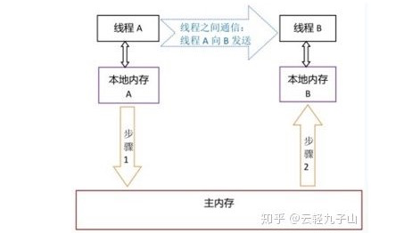

[TOC]


## 1.知识点

## 1.1 内存相关

### Java内存模型是什么？

Java中所有变量都储存在主存中，对于所有线程都是共享的（因为在同一进程中），每个线程都有自己的工作内存或本地内存(Working Memory)，工作内存中保存的是主存中某些变量的拷贝，线程对所有变量的操作都是在工作内存中进行，而线程之间无法相互直接访问，变量传递均需要通过主存完成，但是在程序内部可以互相调用(通过对象方法)，所有线程间的通信相对简单，速度也很快。



2、进程间的内部数据和状态都是相互完全独立的，因此进程间通信大多数情况是必须通过网络实现。线程本身的数据，通常只有寄存器数据，以及一个程序执行时使用的堆栈，所以线程的切换比进程切换的负担要小。

3、CPU对于各个线程的调度是随机的（分时调度），在Java程序中，JVM负责线程的调度。 线程调度是指按照特定的机制为多个线程分配CPU的使用权，也就是实际执行的时候是线程，因此CPU调度的最小单位是线程，而资源分配的最小单位是进程。

### JVM中哪个参数是用来控制线程的栈堆栈小的

-Xss参数用来控制线程的堆栈大小。

### 1.1.1 **JVM分为哪些区，每一个区干吗的？**

1. 方法区(method)：被所有的线程共享。方法区包含所有的类信息和静态变量。
2. 堆(heap)：被所有的线程共享，存放对象实例以及数组，Java堆是GC的主要区域。
3. 栈(stack)：每个线程包含一个栈区，栈中保存一些局部变量等。
4. 程序计数器：是当前线程执行的字节码的行指示器。

### 1.3 **JVM新生代，老年代，持久代，都存储哪些东西？**

持久代主要存放的是Java类的类信息，与垃圾收集要收集的Java对象关系不大。所有新生成的对象首先都是放在年轻代的，年老代中存放的都是一些生命周期较长的对象。

### 1.1.1 堆内存设置的参数是什么？

```
-Xms 设置堆的最小空间大小
-Xmx 设置堆的最大空间大小
```

JVM各参数名称及配置：

```
-Xms ：初始推大小、一般物理内存的1/64(<1GB)
-Xmx: 最大推大小、物理内存的1/4(<1GB)
-Xmn: 年轻代大小(1.4or lator)
-XX:NewSize 设置年轻代大小
-XX:MaxNewSize 年轻代最大值
-XX:PermSize 设置持久代(perm gen)初始值
-XX:MaxPermSize 设置持久代最大值
-Xss 每个线程的堆栈大小
```

### 1.1.2 Java中的堆和栈的区别

栈(操作系统)：有系统自动分配释放、存放函数、局部变量的值等，分配的内存大小在jvm机加载的时候已经开辟了空间，栈的默认空间是2M,如果超出这个大小，就会内存溢出异常。

堆(操作系统):一般有程序员分配释放、若不释放，程序结束时由系统自动回收，类似于new 一个对象会分配空间，大小无法确定，类似链表结构。

区别：栈速度快，灵活性小，堆速度慢，灵活度大。

栈：都是存储局部变量，推：存储的都是对象

### 1.1.3 Java 中会存在内存泄漏吗，请简单描述？

答：理论上Java因为有垃圾回收机制（GC）不会存在内存泄露问题（这也是Java被广泛使用于服务器端编程的一个重要原因）；然而在实际开发中，可能会存在无用但可达的对象，这些对象不能被GC回收，因此也会导致内存泄露的发生。例如hibernate的Session（一级缓存）中的对象属于持久态，垃圾回收器是不会回收这些对象的，然而这些对象中可能存在无用的垃圾对象，如果不及时关闭（close）或清空（flush）一级缓存就可能导致内存泄露

### 1.1.4 哪些情况下的对象会被垃圾回收机制处理掉？

利用可达性分析算法，虚拟机会将一些对象定义为GC Roots，从GC Roots出发沿着引用链向下寻找，如果某个对象不能通过GC Roots寻找到，虚拟机就认为该对象可以被回收掉。

##### 1.1 哪些对象可以被看做是GC Roots呢？

1）虚拟机栈（栈帧中的本地变量表）中引用的对象；
2）方法区中的类静态属性引用的对象，常量引用的对象；
3）本地方法栈中JNI(Native方法）引用的对象；

##### 1.2 对象不可达，一定会被垃圾收集器回收么？

即使不可达，对象也不一定会被垃圾收集器回收
1）先判断对象是否有必要执行finalize()方法，对象必须重写finalize()方法且没有被运行过。
2）若有必要执行，会把对象放到一个队列中，JVM会开一个线程去回收它们，这是对象最后一次可以逃逸清理的机会。

### 调用System.gc()会发生什么?

通知GC开始工作，但是GC真正开始的时间不确定。

### **如果A和B对象循环引用，是否可以被GC？**

回答：可以，现在的虚拟机基本都是通过可达性分析算法来判断对象是否存活的，而不是通过简单的引用计数法来判断对象是否存活。可达性分析算法使用一系列的“GC Roots”对象（虚拟机栈中引用的对象、静态属性引用对象）作为起始点，这些节点向下搜索的路径称为引用链，当一个对象到GC Roots没有任何引用链连接，则证明对象是不可用的。


## 1.2 类加载

### 1.1.1  **JVM如何加载一个类的过程，双亲委派模型中有哪些方法**

类加载过程：加载、验证（验证阶段作用是保证Class文件的字节流包含的信息符合JVM规范，不会给JVM造成危害）、准备（准备阶段为变量分配内存并设置类变量的初始化）、解析（解析过程是将常量池内的符号引用替换成直接引用）、初始化。

双亲委派模型中方法：双亲委派是指如果一个类收到了类加载的请求，不会自己先尝试加载，先找父类加载器去完成。当顶层启动类加载器表示无法加载这个类的时候，子类才会尝试自己去加载。当回到最开的发起者加载器还无法加载时，并不会向下找，而是抛出ClassNotFound异常。

方法：启动（Bootstrap）类加载器，标准扩展（Extension）类加载器，应用程序类加载器（Application ），上下文(Custom)类加载器。意义是防止内存中出现多份同样的字节码 


